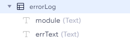

# ITnetworkProject
## Podpora prodeje online kurzů

Aplikace slouží k podpoře registrace na online kurzy, které probíhají na platformě Zoom.
Zatím je možné zakoupit si účast na živém vysílání, později přibude možnost prodeje už hotových nahrávek.

Pro vytváření objednávek a faktur je využíváno API služby BitFaktura.
A pro zjišťování plateb se využívá připojení přes API klíč do Fio banky.

Registrační formulář je zde:
( vytvářel jsem jej ve FrameWorku Wix )

https://www.ivetahavlova.cz/prihlaska-na-kurz

Po zvolení druhé volby se formulář rozšíří o kompletní zadání údajů potřebných pro fakturaci:

### Přihláška na kurz - přehled
( opět jsem vytvářel ve frameworku Wix - přístup jen pro roli admin )

## Modul pro vytváření objednávek a faktur - [js/Invoice.js](js/Invoice.js)

Třída Invoice obsahuje tyto metody:
- **async creEstimate(courseID, approvedOrders, comm, dept)**
  - vytvoření objednávky 
- **async creVat(courseID, prefix, vs, comm, dept, i_sell_date)**
  - vytvoření faktury

Obě používají metodu create ( jen s jinými parametry )
- **async createLoop(v_subCoursesData, typ, dept, status, vs, prefix, i_sell_date, comm)**
  - pro ctění přístupu DRY, Dont Repeat Yourself

### Modul [js/invoice.jsw](js/invoice.jsw) obsahuje vytvoření nové instance třídy Invoice a funkce pro volání z frontendu

## Modul pro zpracování bankovních transakcí - [js/BankTransactions.js](js/BankTransactions.js)

Třída BankTransactions obsahuje tyto metody
- **fetchData(nameAPI, dateFrom, dateTo)**
  - načtení bankovních transakcí přes API ( klíč je uchován skryt v Secret Managerovi ve Wixu )
- **saveData(nameAPI, dateFrom, dateTo, state)**
  - uložení dat do tabulky eshop_bankTransactions
- a **matchPayments(courseID, prefix, comm, dept)**
  - spárování dat na základě variabilního symbolu a vytvoření objednávky

### Modul [js/bankTransactions.jsw](js/bankTransactions.jsw) obsahuje vytvoření nové instance třídy BankTransactions a funkce pro volání z frontendu

## Modul s SQL příkazy a práci s daty - [js/datasql.jsw](js/datasql.jsw)
- **async function logErr(moduleName, err)**
  - logování chyb s názvem modulu a textem chyby
- **function getDateF(days)**
  - funkce vrátí formátovaný datum pro využití v práci s DB a API ( např. getdate(1) vrátí zítřejší datum ve formátu YYYY-MM-DD )
- **async function getSubCoursesData(courseID, email_prefix, priznak_VS)**
  - vrací řádky / řádek s daty registračního formuláře pro vytvoření objednávky/faktury
- **async function updLastOrdNum(courseID, docNum, email)**
  - pro aktualizaci posledního čísla objednávky
- **async function updBankMovements(idPohybu_stateFrom, stateTo)**
  - pro update stavu bankovní transakce buď podle jejího ID nebo stavu )
- **async function insBankTransactions(idPohybu, datum, objem, mena, nazevProtiuctu, vs, zpravaProPrijemce, stav)**
  - pro vložení řádku bankovní transakce ( používá se API fetch - funkce fetchData )
- **async function getBankMovements(state)**
  - vrátí bankovní transkace podle stavu ( typicky loaded, se kterými se dále pracuje ve funkcích fetchData, saveData a matchPayments )

## Struktura DB tabulek

### Registrační formulář:

### Bankovní transakce:

### Logování chyb:

