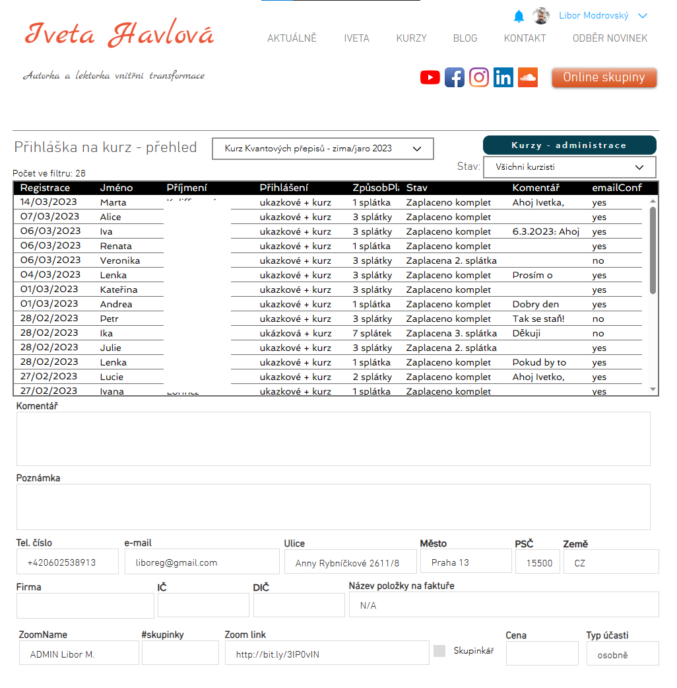

# ITnetworkProject
## Podpora prodeje online kurzů

Aplikace slouží k podpoře registrace na online kurzy, které probíhají na platformě Zoom.
Zatím je možné zakoupit si účast na živém vysílání, později přibude možnost prodeje už hotových nahrávek.

Pro vytváření objednávek a faktur je využíváno API služby BitFaktura.
A pro zjišťování plateb se využívá připojení přes API klíč do Fio banky.

Registrační formulář je zde:
( vytvářel jsem jej ve FrameWorku Wix )

https://www.ivetahavlova.cz/prihlaska-na-kurz

Po zvolení druhé volby se formulář rozšíří o kompletní zadání údajů potřebných pro fakturaci:

### Struktura tabulky pro registrační formulář:

### Přihláška na kurz - přehled
( opět jsem vytvářel ve frameworku Wix )

## Kód pro vytváření objednávek a faktur - [js/Invoice.js](js/Invoice.js)

Třída Invoice obsahuje tyto metody:
- **creEstimate(courseID, approvedOrders, comm, dept)** - vytvoření objednávky 
- **creVat(courseID, prefix, vs, comm, dept, i_sell_date)** - vytvoření faktury

Obě používají metodu create ( jen s jinými parametry )
- a **createLoop(v_subCoursesData, typ, dept, status, vs, prefix, i_sell_date, comm)** - pro ctění přístupu DRY, Dont Repeat Yourself

### Soubor [js/invoice.jsw](js/invoice.jsw) obsahuje vytvoření nové instance třídy Invoice a funkce pro volání z frontendu

## Kód pro zpracování bankovních transakcí - [js/BankTransactions.js](js/BankTransactions.js)

Třída BankTransactions obsahuje tyto metody
- **fetchData(nameAPI, dateFrom, dateTo)** - načtění bankovních transakcí přes API ( klíč je uchován skryt v Secret Managerovi ve Wixu )
- **saveData(nameAPI, dateFrom, dateTo, state)** - uložení dat do tabulky eshop_bankTransactions
- a **matchPayments(courseID, prefix, comm, dept)** - spárování dat na základě variabilního symbolu a vytvoření objednávky

### Soubor [js/bankTransactions.jsw](js/bankTransactions.jsw) obsahuje vytvoření nové instance třídy BankTransactions a funkce pro volání z frontendu

## Modul s SQL příkazy a práci s daty - [js/datasql.jsw](js/datasql.jsw)

### Struktura tabulky pro bankovní transakce:

### Struktura tabulky pro logování chyb:

